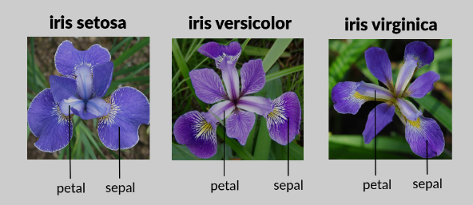

<h2>PCA - Principal Component Analysis</h2>

Where to use? 
data compression 
photo compression 
By performing this process before running face recognition algorithms, only the most distinctive features of the human face are obtained.

<h2> Reducing the Number of Features Using IRIS Flower Analysis and PCA</h2>

The data set we will use as an example is the "Iris" data set, one of the most popular data sets in the field of artificial learning. The Iris data set is a data set belonging to 3 Iris plant species (Iris setosa, Iris virginica and Iris versicolor), with a total number of 150 samples, 50 samples from each species. 4 features were defined for each sample: petal length, petal width, sepal width, sepal length ('sepal length','sepal width','petal length','petal width').

In our data set, each plant sample represents a separate observation (sample); The name of the plant species refers to the dependent variable, and the 4 basic measured characteristics of the plants represent independent variables.

<b>PCA Projection from 4 dimensions to 2 dimensions<b>

Our original data has 4 dimensions: 'sepal length', 'sepal width', 'petal length', 'petal width'

We will reduce them to 2 dimensions by performing PCA, but the 2 dimensions we will obtain as a result of the PCA reduction process will have titles that do not make any sense. In other words, what we are doing is not simply throwing away 2 of the 4 features.

